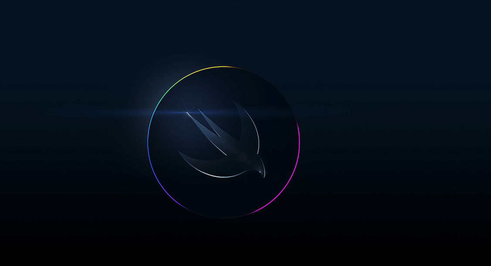

# iOS Разработчик Саинчук Николай

Меня зовут Николай,
я студент школы Нетология. Учусь на професиию iOS разработчик.

## Пройденные блоки курса:

1. Основы Swift
2. iOS - dev: основы swift advanced
3. Git - система контроля версий
